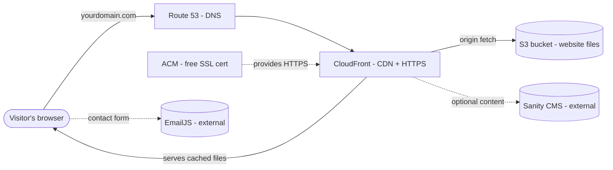

# Hosting the KWANBH Website on AWS — Deployment Guide & Cost Report

**Prepared for:** Dr. Kwan‑Lamar Blount‑Hill website (`kwanbh_website-final`)
**Date:** July 2026
**Goal:** Put the finished website online using your existing AWS account, with a clear picture of what it will cost per month.

---

## 1. Bottom line up front (the short version)

Your website is a **static site** (plain files: HTML, CSS, JavaScript, images). It has **no server, no database, and no backend code** to run. That is the cheapest and most reliable kind of site to host, and AWS is a great fit.

**Recommended setup:** Amazon **S3** (stores the files) + **CloudFront** (fast global delivery + free HTTPS) + **Route 53** (DNS/domain) + **ACM** (free SSL certificate).

**What it will cost you, realistically:**

| Item | Monthly | Yearly |
| --- | --- | --- |
| Website hosting (S3 + CloudFront + SSL) | ~$0.00 – $0.50 | ~$0 – $6 |
| DNS (Route 53 hosted zone) | $0.50 | $6.00 |
| Domain name (.com, if managed in AWS) | ~$1.25 | ~$15 (renews yearly) |
| **Realistic all‑in total** | **≈ $1 – $2 / month** | **≈ $15 – $25 / year** |

> In plain terms: **hosting the site itself is essentially free** (it fits inside AWS's permanent free allowances). The only guaranteed charge is the ~$0.50/month for DNS and the yearly domain renewal (~$15). This is *added on top of* your current office/Transcribe AWS bill and **will not affect or interfere with your Amazon Transcribe usage.**

---

## 2. What your website actually is (and why it's so cheap to host)

I inspected the project. Here is what it is:

- **Type:** A single-page website built with **Vite + React + TypeScript**.
- **Pages:** Home, About, CV, Service, Contact (plus content for projects, publications, teaching, donate).
- **Build output:** Running the build produces a small `dist/` folder — currently about **1.8 MB total** (a few HTML/JS/CSS files and a handful of images). That is tiny.
- **Contact form:** Uses **EmailJS**, which sends email directly from the visitor's browser. It needs **no server** on your side.
- **Content management (Sanity / TinaCMS):** These are **external, hosted services** (run by those companies, not by you). They do not need anything running on AWS.
- **No database. No backend API. No server process.**

Because everything is just static files, we do **not** need expensive AWS services like EC2 servers, load balancers, or databases. We only need somewhere to put the files and a way to deliver them quickly and securely.

---

## 3. Recommended AWS architecture



**What each piece does:**

- **Amazon S3** — A storage bucket that holds your built website files (`dist/`). Cheap and durable.
- **Amazon CloudFront** — Amazon's global content delivery network (CDN). It caches your site at 750+ locations worldwide so it loads fast everywhere, and it provides **free HTTPS (the padlock)**. It also shields the S3 bucket and absorbs traffic spikes.
- **AWS Certificate Manager (ACM)** — Issues the **free SSL/TLS certificate** used by CloudFront so your site is `https://`.
- **Amazon Route 53** — Amazon's DNS service. It connects your domain name (e.g. `yourdomain.com`) to the CloudFront distribution.

This is the standard, industry-recommended way to host a static website on AWS. It is fast, secure, and very low cost.

---

## 4. Detailed cost breakdown

All prices below are current AWS pricing (verified 2026) for the standard `us-east-1` region. Your traffic as a personal/professional site will be very low, which keeps you inside AWS's free allowances.

### 4.1 Amazon S3 (file storage)

| What | Rate | Your usage | Your cost |
| --- | --- | --- | --- |
| Storage | $0.023 per GB / month | ~0.002 GB (2 MB site) | **~$0.00** (a fraction of a cent) |
| Requests | ~$0.0004 per 1,000 GETs | Very low (CloudFront caches) | **~$0.00** |

**S3 total: effectively $0/month.**

### 4.2 Amazon CloudFront (delivery + HTTPS)

CloudFront has a **permanent free tier that never expires**:
- **1 TB (1,000 GB) of data transfer out per month — free, forever**
- **10,000,000 requests per month — free, forever**
- Free SSL certificate

Your entire site is ~2 MB. To even approach the free limit you would need roughly **500,000 full page loads per month**. A scholar/professional website will not come close. 

**CloudFront total: $0/month** for the foreseeable future.

> **Even simpler, guaranteed‑$0 option:** AWS now offers a **CloudFront "Free" flat‑rate plan at $0/month** (launched late 2025) that bundles CDN + DNS + HTTPS + basic security with a 100 GB/1M‑request monthly allowance and **no overage charges ever**. Your established (non‑free‑tier) AWS account is eligible. This is optional — the pay‑as‑you‑go free tier above already covers you — but it's a nice "no surprise bills" guarantee.

### 4.3 Amazon Route 53 (DNS)

| What | Rate | Your cost |
| --- | --- | --- |
| Hosted zone (1 domain) | $0.50 / month | **$0.50 / month** |
| DNS queries to CloudFront (Alias records) | **Free** | **$0.00** |

**Route 53 total: $0.50/month** (~$6/year). This is the one small charge that is always present.

### 4.4 AWS Certificate Manager (SSL certificate)

Public SSL certificates used with CloudFront are **free**. **$0.**

### 4.5 Domain name

You can keep your current domain name. If you **register or renew** a `.com` through AWS (Route 53), it is about **$15/year** (AWS lists .com at ~$15, moving to ~$16 from July 1, 2026). Other endings (.org ≈ $15, .io ≈ $39, etc.) vary. For comparison, Squarespace .com renewals are typically ~$20/year, so AWS is similar or slightly cheaper.

> You do **not** have to move the registration to AWS. You can keep the domain registered at Squarespace and simply point it at AWS (see Section 5). In that case AWS charges you nothing for the domain and you keep paying Squarespace's renewal only.

### 4.6 Total cost summary

| Scenario | Monthly | Yearly |
| --- | --- | --- |
| Hosting only (S3 + CloudFront + SSL) | ~$0.00 – $0.50 | ~$0 – $6 |
| Hosting + Route 53 DNS | ~$0.50 – $1.00 | ~$6 – $12 |
| Hosting + DNS + domain in AWS | **~$1 – $2** | **~$15 – $25** |

**Realistic expectation: about $1–$2 per month, or roughly $15–$25 per year, dominated by the domain renewal.** If a page ever goes viral, the free tiers absorb it — you will not get a shock bill.

---

## 5. Your Squarespace domain — 3 options

You said you have a domain at Squarespace and are willing to change it. Here are your choices, best first:

**Option A — Keep the domain name, just point it at AWS (recommended, free, fastest).**
1. Create a **Route 53 hosted zone** for your domain in AWS. AWS gives you 4 nameservers.
2. In your **Squarespace** domain settings, replace the nameservers with those 4 AWS nameservers.
3. Done — AWS now controls the DNS, but the domain stays registered at Squarespace (you keep paying only Squarespace's yearly renewal). Adds $0.50/month for the hosted zone.

**Option B — Transfer the domain into AWS (consolidates everything in one bill).**
1. In Squarespace, unlock the domain and get the **authorization/EPP code**.
2. In Route 53 → Registered domains → **Transfer**, enter the domain and code.
3. Costs a one-time **~$15** (which also adds a year of registration) and takes a few days. After that, everything (domain + DNS + hosting) is billed through AWS.

**Option C — Register a brand-new domain in AWS.**
- If you'd rather start fresh, register a new name directly in Route 53 (~$15/year for .com) and skip Squarespace entirely.

**Recommendation:** Use **Option A** if you want the fastest path and to keep your current web address and its search-engine history. Use **Option B** if you'd prefer a single AWS bill for everything.

---

## 6. Step-by-step deployment (recommended path)

You can do all of this in the **AWS Console** (point-and-click). I've grouped it into clear stages. Substitute `yourdomain.com` with your real domain.

### Prerequisites (one time)
- **Node.js 20 (LTS)** installed on your PC, so you can build the site.
- **An IAM user** in your AWS account with permissions for S3, CloudFront, ACM, and Route 53 (don't use the root login for daily work).
- Optionally, the **AWS CLI v2** installed and configured (`aws configure`) if you want the quick command-line redeploy in Section 6.7.

### 6.1 Build the website
From the project folder (`E:\PROJECTS_Backup\KWANBH\kwanbh_website-final`):

```bash
npm install
npm run build
```

This creates/updates the **`dist/`** folder — that folder's contents are exactly what gets uploaded.

> Note: The site reads settings (EmailJS, Sanity) from `.env.local` at build time. Since that file already exists in your project, a local build will include them automatically. Keep `.env.local` private (do not commit it to a public repo).

### 6.2 Create the S3 bucket
1. S3 → **Create bucket**. Give it a unique name (e.g. `kwanbh-website`).
2. Leave **Block all public access = ON** (the bucket stays private; CloudFront will read from it securely).
3. **Upload** everything **inside** your `dist/` folder into the bucket.

### 6.3 Request the free SSL certificate (ACM)
1. Switch the console region to **US East (N. Virginia) / us-east-1** — CloudFront requires the certificate to live there.
2. ACM → **Request a public certificate** → add `yourdomain.com` **and** `www.yourdomain.com`.
3. Choose **DNS validation**. (If your DNS is already in Route 53, you can click "Create records in Route 53" and it validates automatically.)

### 6.4 Create the CloudFront distribution
1. CloudFront → **Create distribution**.
2. **Origin:** select your S3 bucket. For "Origin access," choose **Origin access control (OAC)** and let CloudFront update the bucket policy for you (this keeps the bucket private but readable by CloudFront).
3. **Viewer protocol policy:** Redirect HTTP to HTTPS.
4. **Default root object:** `index.html`.
5. **Alternate domain names (CNAMEs):** `yourdomain.com` and `www.yourdomain.com`.
6. **Custom SSL certificate:** pick the ACM certificate from step 6.3.
7. (Recommended) Under **Error pages**, add two custom responses so links work correctly: HTTP **403 → `/index.html` (200)** and **404 → `/index.html` (200)**.

### 6.5 Point your domain at CloudFront (Route 53)
1. Route 53 → **Create hosted zone** for `yourdomain.com` (if you don't have one yet).
2. Create an **A record** for the root domain, type **Alias**, target = your **CloudFront distribution**. Repeat for `www` (and an AAAA record too, for IPv6).
3. Update your domain's **nameservers** at Squarespace to the 4 nameservers Route 53 shows for the hosted zone (this is Option A in Section 5). Or transfer the domain (Option B).

### 6.6 Verify
- Wait for DNS to propagate (usually minutes to a few hours; up to 48h worst case) and for the certificate to show **Issued**.
- Visit `https://yourdomain.com` — you should see the site with a padlock. Test the Contact form and navigation.

### 6.7 Redeploying later (whenever you change the site)
Rebuild and sync. With the AWS CLI this is two commands:

```bash
npm run build
aws s3 sync dist/ s3://kwanbh-website/ --delete
aws cloudfront create-invalidation --distribution-id YOUR_DISTRIBUTION_ID --paths "/*"
```

The `sync` uploads changed files; the `invalidation` tells CloudFront to serve the fresh version. (CloudFront invalidations are free for the first 1,000 paths per month.)

---

## 7. Easiest alternative: AWS Amplify Hosting

If you'd prefer **not** to manage S3 + CloudFront + Route 53 separately, **AWS Amplify Hosting** is a managed option built for exactly this kind of site:

- Connect your **GitHub** repository. Amplify auto-detects the build (`npm run build`, publish folder `dist`).
- Every time you push a change to GitHub, Amplify **rebuilds and redeploys automatically**.
- It provides the CDN, **free HTTPS**, and **custom domain setup** in one place (no separate CloudFront/Route 53 wiring).
- You set the `VITE_...` environment variables in the Amplify console.

**Cost:** For a low-traffic site, roughly **$0–$3/month** (build minutes are ~$0.01/min; data served is $0.15/GB; a few GB/month is a few cents to a couple dollars), plus the domain. Slightly higher than S3+CloudFront at scale, but the simplest to operate.

**Which to choose:**
- **S3 + CloudFront + Route 53** → lowest cost, most control, and CloudFront's 1 TB free tier makes delivery free. Best long-term.
- **Amplify** → simplest hands-off setup with automatic deploys from GitHub. Best if you value convenience over squeezing out the last cent.

---

## 8. Optional but recommended extras

- **Set a budget alert.** In AWS **Billing → Budgets**, create a small budget (e.g. $5/month) with an email alert. The first two budgets are free. This guarantees you'll be notified long before any unexpected cost — good peace of mind given the shared office account.
- **Housekeeping in the repo.** The project folder contains a stray `python_installer.exe` (~260 KB) and some duplicate/backup files (`*.bak`). These are not part of the website and should not be uploaded — only the `dist/` folder gets deployed, so they won't reach AWS, but you may want to delete them from the project for tidiness.
- **Keep secrets out of public repos.** `.env.local` holds your EmailJS/Sanity keys. It's fine for building locally, but don't push it to a public GitHub repo.

---

## 9. Recommendation & next steps

1. **Decide on the domain approach** — I recommend **Option A** (keep the name, point nameservers at Route 53) for continuity, or **Option B** (transfer to AWS) if you want one bill.
2. **Deploy using S3 + CloudFront + Route 53** (Section 6) for the lowest cost, *or* **Amplify** (Section 7) if you prefer the simplest, auto-deploy workflow.
3. **Expected ongoing cost: about $1–$2/month (~$15–$25/year)**, essentially the DNS charge plus the yearly domain renewal. The hosting itself is effectively free at your traffic level, and it will not affect your existing office or Amazon Transcribe usage.

If you'd like, I can provide the exact AWS CLI script to create the bucket, upload the files, request the certificate, and set up CloudFront end-to-end, so the whole thing can be done by running one script.

---

*Prepared with Oz (Warp).*
